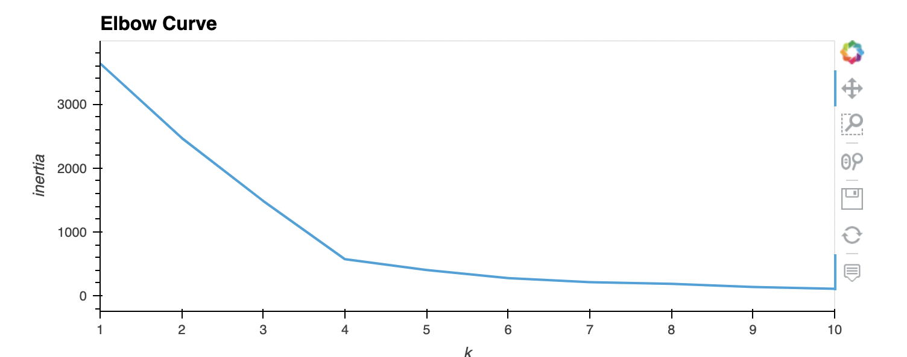
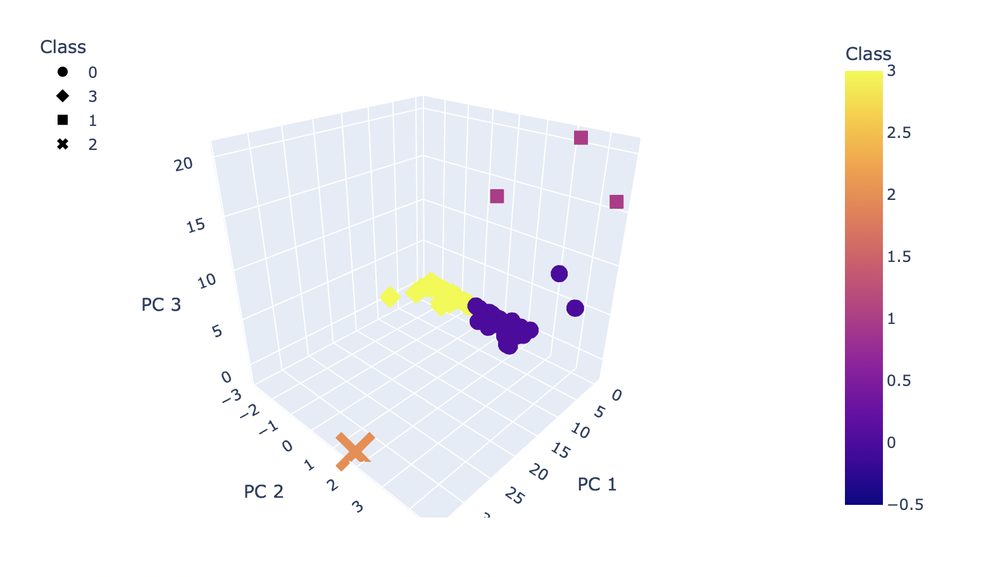

# Cryptocurrency Analysis

## Overview of the Project

This project is to research on crypto currencies. With the boom on crypto currencies and the popular ones being costly, this research is for identifying the upcoming crypto currencies that could be recommended.

## Resources
- Data Source: crypto_data from CyptoCompare
- Software: Python, Scikit, jupyter notebook
---

## Results

Using the elbow curve determined 4 would be the best number of clusters.

Applying K means got 4 clusters

---

## Summary

Using the above data we can see how the data is group and use it for further analysis and recommendation.
